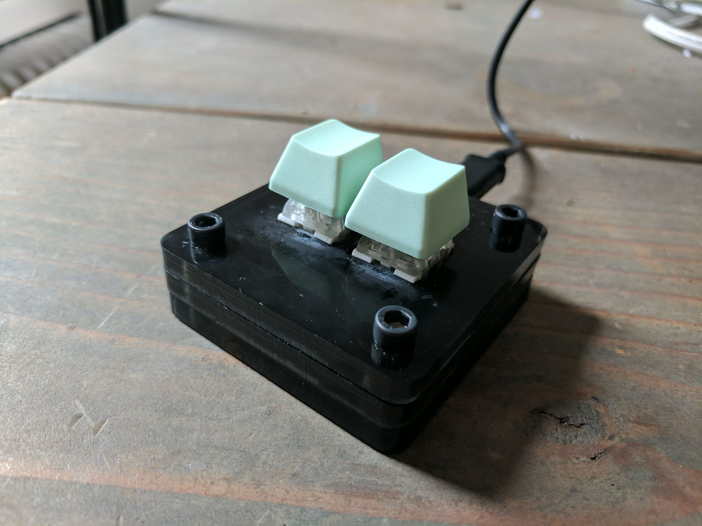
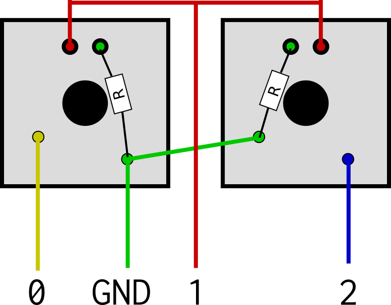

# Making the 2-key osu! Keyboard

### Table of contents

* [About](#about)
* [Parts required](#parts-required)
* [Assembling the case](#assembling-the-case)
* [Assembling the rest of the keyboard](#assembling-the-rest-of-the-keyboard)
* [Installation](#installation)
* [Flashing](#flashing)
* [Use](#use)
* [Bugs](#bugs)
* [Future](#future)

### About



[Album](https://imgur.com/a/kQkXmyP).

This is a simple osu! keyboard made for the ATtiny85 (specifically, the
[Adafruit Trinket](https://www.adafruit.com/product/1501)). It works by using
V-USB to emulate an actual keyboard.

The ATtiny85, though limited in comparison to other microcontrollers typically
used for keyboards (like the ATmega32u4), functions perfectly for use as an
osu! keyboard. 

It has support for LEDs, though not on a per-key basis.

Most of this guide assumes you are using a Trinket, although I have no reason
to believe that other microcontrollers won't work; I just don't know their
nuances.

I recommend you read or skim through the whole guide before choosing to
build one of these keyboards.

### Parts required

For the functional part of the keyboard, you'll need the following:
* An ATtiny85-based microcontroller, e.g.
  [Trinket](https://www.adafruit.com/product/1501) or
  [Digispark ebay
  clones](https://www.ebay.com/itm/Digispark-Kickstarter-ATTINY85-Arduino-General-Micro-USB-Development-Board/351877226756)
  This has only been tested on the Trinket.
* Some wire and a soldering iron.
* Two switches and keycaps.
* A Micro-USB cable.
* (Optional) 2 LEDs and appropriate resistors.

To make a case, you'll need the following:
* A laser cutter.
* Around 3" x 12" (8 x 31 cm) of acrylic or wood, more recommended in case of
  errors laser cutting. 1/16" thick material is required for the switch plate.
* At least 4 screws, optional: washers (if you don't tap the case material).
* (Optional) 4 rubber feet, e.g.
  [these](https://www.amazon.com/Rockler-45929-Piece-Rubber-Bumpers/dp/B006Z7B16Y).
  I'd recommend ones that can be secured with screws since then you can use those
  screws to secure your case, too (note: the screws in the linked rubber feet
  will likely be too short).

Depending on what sort of parts you buy, this shouldn't cost more than $10 to
$20 dollars (keycaps and switches are about $1 per, LEDs and resistors combine
to be $3, the microcontroller is somewhere in the range of $1 to $7, and
acrylic and wood make up the rest). Since this uses so few parts and you
usually buy most of these in bulk, ideally you'd spend only the cost of a
microcontroller and maybe one more part.

### Assembling the case

First, you'll a representation of your keyboard. If you're just
making the basic 2-key osu! keyboard, then you can just copy/paste
the below into the Plate Layout section for the next part.

```
["Z","X"]
```

Otherwise, go to
[keyboard-layout-editor.com](http://www.keyboard-layout-editor.com/)
and make your custom layout. Be aware that if you're using the Trinket
(and probably any other ATtiny85-based controllers), you may not be
able to use more than 2 keys (see [Bugs](#bugs)).

Now you'll need to generate your case. I highly recommend using
[builder.swillkb.com](http://builder.swillkb.com/), which is what I'll
be walking through.

Most of the website is pretty self-explanatory. Here are some things to look
out for.

* Make sure you select your switch type (MX t:3 is the preferred MX style since
  it allows you to change springs and stems with the switch still mounted).
* Select Sandwich for the case style.
* Make sure you change the hole sizes to fit your screws. If you're tapping
  your case material to hold the screws, make sure you cut smaller than the
  screw size for your bottom layer (or top, wherever your screws will
  terminate) and larger than the screw size for the rest.
* Add a value to the Plate Corners setting if you want
  to have rounded corners.
* If you are using the Trinket, make sure that you *enable USB Cutout and
  change the width to at least 16mm*. This is because the Trinket is around
  15.5mm large and you will want its Micro-USB port to poke out of the edge of
  the case.
* Set the kerf if you know what it is for your laser cutter and material.

Depending on the thickness of your material, you can get away with different
combinations of layers for your case. When I made mine, I was using 1/4"
acrylic and I only cut out the bottom, switch, and open layers. It was a _tight
fit_, but I got it to work. In general, I would leave a minimum of 1/4" of
vertical height for your microcontroller to occupy, but if you've got better
soldering skills and are confident that you can squeeze everything into a
smaller space, go for it. Having a large horizontal cavity, at least for the
Trinket, isn't really necessary given how small it is; _however_ I would still
recommend a reasonably large one to fit wires or a perfboard (see my note on
the perfboard in the next section).

If you want, you can also cut out your top or bottom later large enough to
fit your screw head. You'll have to generate another CAD to resize the holes
and then just take the top or bottom layer from it.

Don't forget that the switch layer needs to be 1/16" thick for the switches to
fit nicely. You can do without it: mine fit snugly because of the cut, but
they pop out when I'm trying to remove the caps.

Once you have the parts laser cut (which is a beast of its own that I won't go
into since machines vary), all you need to do to assemble them is put the
screws through. And tap a layer if you're doing that. The parts go in a
somewhat logical order: top, switch, closed, open, bottom, with enough closed
layers to make the case as tall as you need it. You can forgo layers (like top)
if you're using thick material like me or if you don't care if the switches are
more exposed.

### Assembling the rest of the keyboard

This section assumes you are using the Adafruit Trinket, since that's the only
microcontroller I've used to make this keyboard. 

You can either wire things directly together or wire them to a
[perfboard](https://en.wikipedia.org/wiki/Perfboard) that you connect to
the Trinket. I did the former, and I was originally going to strongly
recommend you use a perfboard, but I think if you're smart enough about
the way you wire things up, you should be fine.

Here's where things go:

* One switch: pin 0 and GND.
* The other switch: pin 2 and GND.
* (Optional) Both LEDs: anode (long leg) to pin 1 and cathode (short leg) to GND.

Here are some tips:

* I've included a diagram below of how I would recommend wiring up the circuit.
  The holes above the switch are for the LEDs, which are optional. I don't
  think I need to say this, but just in case it isn't clear, _don't make a
  connection between pin 1 and GND_. If the wires cross, make sure there's
  something keeping them from actually touching (like insulation). 
* The Trinket only has 1 ground port, but you'll need to wire 4 grounds if you
  want LEDs (2 otherwise). Flip one LED so that both cathodes are adjacent.
  Then connect each cathode with a resistor to one end of the switch. Join
  those GND pins of the switches together with a wire. Now all you need to do is
  attach a wire to one pin of a switch and all of the grounds are connected.
  You'll still need to be inventive about how you connect the anodes.
* If you find that difficult, you can wire each part individually and put it all
  on a perfboard, then connect the perfboard to the Trinket. This may prove
  more cumbersome than wiring directly, although it will probably be easier to
  service.
* Wire everything under the assumption that your keyboard won't work first try
  and you'll have to troubleshoot it! I did _not_ do this, and got incredibly
  lucky, but I'll pay the price when it inevitably breaks because of my
  shoddy wiring and I'll have to redo everything from scratch.

Click for a larger image.
<a href="images/kb-wiring-diagram.png"></a>

### Installation 

Here's what you'll need:

* This repo (specifically, the keyboard part). If you're unfamiliar with
  git/GitHub, click "Clone or Download" and then "Download ZIP." Unzip the file
  and place the `keyboard` folder somewhere you can find again.
* [Arduino IDE](https://www.arduino.cc/en/Main/Software).
* (Trinket only) Adafruit's board software, which you can install in Arduino by
  going to Tools > Board > Boards Manager > and searching for "Adafruit AVR
  Boards".
* [TrinketKeyboard](https://github.com/adafruit/Adafruit-Trinket-USB).
  Download or clone it and place the TrinketKeyboard in Arduino's Libraries
  folder (typically found in Documents/Arduino). Search around online if you
  can't find it.

Once you have everything set up, all you need to do is configure the file.
Open `keyboard.ino` with you preferred text editor (e.g. the Arduino IDE) and
change `PIN_Z` and `PIN_X` to reflect what pin you put which key on (otherwise
they'll be inverted, not that it matters much). Configure `CONFIG_DELAY` to be
however long you want; I recommend at least 4 seconds (4000 ms). Then you
should be set. If for some reason you want the board running at 16 MHz,
uncomment the line in `setup()`. Though all timing that I use _should_ be
absolute (i.e. in milliseconds, not clock cycles), I could have made a mistake
and changing to 16 MHz may skew with the timing.

### Flashing

Flashing the Trinket is not hard, but it isn't especially intuitive if you've
used Arduino before. You need to select the board in Tools > Board, which is
"Adafruit Trinket (ATtiny85 @ 8 MHz)" (or 16 MHz if you're running it at that
speed). Then select the programmer in Tools > Programmer as "USBtinyISP". You
_don't_ need to select a port since the Trinket can't communicate over
serial.

To flash it, either plug it in and flash immediately or press the reset button
then flash. When you see the light flashing is when it's good to flash (good
mnemonic, eh?). You can flash by pressing the "Upload" button in the Arduino
IDE (the one that looks like a right arrow).

The Trinket enters this "upload mode" each time it's plugged in, which makes it
very easy to reflash it should there be changes to the firmware.  However, it
does come with an inconvenience: you have to wait a few seconds after you plug
your keyboard in until you can use it. 

### Use

Use the keyboard as, well, a keyboard. There are a couple of extra features
that you can configure without changing the firmware.

When you enter a configuration mode, your computer may inform you that your
keyboard has disconnected. This is because if the keyboard does not continue to send updates
every approximately 10 milliseconds, it will disconnect. However, the keyboard
just reconnects when you exit the mode.

To set the brightness of the LEDs, hold down both Z and X until the keyboard's
lights blink thrice. This signifies the keyboard is in LED brightness
configuration.  Press the X key to cycle through various levels of brightness,
and then the Z key to save and return. This will save your light level
peference to EEPROM, so even if the keyboard is restarted, it will retain that
value. 

To change the LED mode, hold down the Z key until the keyboard's lights blink
twice. This signifies the keyboard is in LED mode configuration. Press the X
key to toggle between Always On and Keypress (Always On is denoted by the
lights on the keyboard being on in this mode, and Keypress is denoted by them
being off). In Always On mode, the LEDs are always on. Unless you've set the
brightness to 0, in which case they're always off. In Keypress mode, the LEDs
only turn on when at least one key is held down. Press the Z key to save
and return.

### Bugs

Right now, I'm not entirely sure why I seemingly cannot use pins 3 and 4 as
output or input, as well as pin 1 as input. I tested my Trinket in a hurry, so
it could easily have been an issue with my wiring, although I suspect it might
be that those pins are in use for V-USB purposes. I don't quite know. This bug
is the reason why lighting is not per-key.

### Future 

TBD
* Clean up code and comment better.
* Make it so that the keyboard doesn't disconnect when you enter
  a configuration mode.
* Make it so that the only way to enter configuration mode is by pressing and
  holding both Z and X (unlikeliest to be done during actual play). 
* Add pictures (will likely take a while for me to do as I don't have the keyboard anymore).

Maybes
* I would like to make an (open source) PCB for this project since wiring was a
  PITA.
* Though this is for the ATtiny85, if you're interested in a version which
  is for a microcontroller that supports real USB communication, feel
  free to fork this repo or ask me to support it (it should be about
  as simple as changing the library used). 
